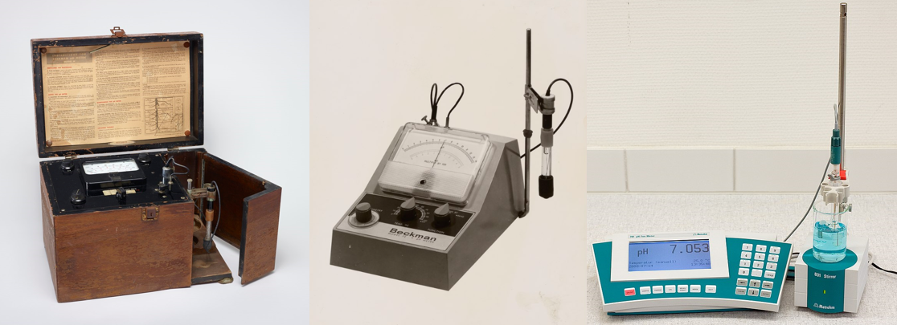

# Bereiden van Buffers en Oplossingen

## Hoofdpagina uitwerkingen

---

*pH meters in 1937, 1960 and 2008. Bron: https://en.wikipedia.org/wiki/PH_meter*

## Docenten

- [Docenten](./docenten/docenten.md)

## Inhoud

- [Evenwichten opstellen](./uitwerkingen/01_evenwichten_opstellen.md)  
- [Rekenen aan evenwichten ](./uitwerkingen/02_evenwichten_rekenen.md)  
- [Het principe van LeChatelier en het verschuiven van evenwichten](./uitwerkingen/03_lechatelier.md)  
- [Introductie zuren](./uitwerkingen/04_zuren.md)  
- [Introductie basen](./uitwerkingen/05_basen.md)  
- [Zuurconstanten](./uitwerkingen/06_zuurconstanten.md)  
- [Baseconstanten](./uitwerkingen/07_baseconstanten.md)  
- [De Waterconstante](./uitwerkingen/08_waterconstante.md)  
- [Zuur-base paren](./uitwerkingen/09_zuurbasenparen.md)  
- [Van Ka naar Kb](./uitwerkingen/10_ka_naar_kb.md)  
- [pKa en pKb waarden](./uitwerkingen/11_rekenen_pka.md)  

--- 

>This web page is distributed under the terms of the Creative Commons Attribution License which permits unrestricted use, distribution, and reproduction in any medium, provided the original author and source are credited.
>Creative Commons License: CC BY-SA 4.0.

